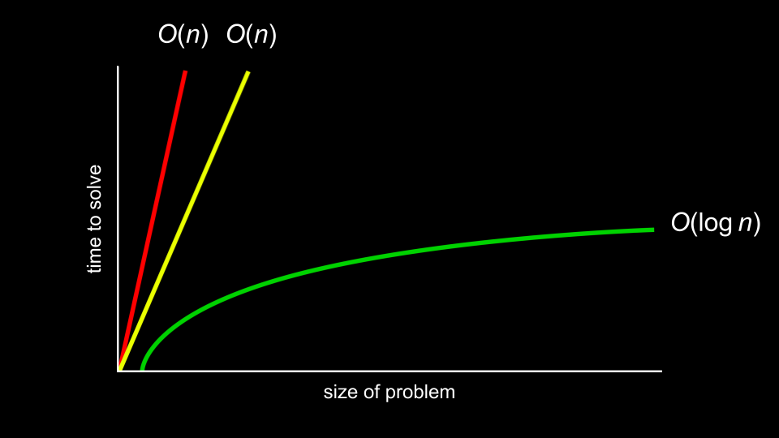

# Lecture 3

## Search

### Linear Search

```c
For each door from left to right
    If 50 is behind door
        Return true
Return false
```

psuedocode

Linear Search search an array by going through each entry in order until the result is found.

```c
For i from 0 to n-1
    If 50 is behind doors[i]
        Return true
Return false
```

psuedocode

### Binary Search

```c
If no doors left
    Return false
If 50 is behind middle door
    Return true
Else if 50 < middle door
    Search left half
Else if 50 > middle door
    Search right half
```

psuedocode

Also called the divide and counquer method.

```c
If no doors left
    Return false
If 50 is behind doors[middle]
    Return true
Else if 50 < doors[middle]
    Search doors[0] through doors[middle - 1]
Else if 50 > doors[middle]
    Search doors[middle + 1] through doors[n - 1]
```

psuedocode

### Running Time



Running time is often described and simplified using "*big O*" notation. *Big O* removes the constants and describe the sorting times using the *order of n*.

Some common running times are:

- *O*(n²)
- *O*(n log n)
- *O*(n)
- *O*(log n)
- *O*(1)

In these examples *O*(1) is the best and *O*(n²) is the worst.

Linear search was of order *O*(n) because it could take n steps in the worst case to run. Binary search was of order *O*(log n) because it would take fewer and fewer steps to run even in the worst case, or upper bound.

The best case, or lower bound, is denoted using the omega **Ω** symbol, like **Ω**(log n).
the **Θ** symbol is used when the upper and lower bounds are the same.

### search.c

#### Linear search with numbers

```c
#include <cs50.h>
#include <stdio.h>

int main(void)
{
    int numbers[] = {20, 500, 10, 5, 100, 1, 50};

    int n = get_int("Number: ");
    for (int i = 0; i < 7; i++)
    {
        if (numbers[i] == n)
        {
            printf("Found\n");
            return 0;
        }
    }
    printf("Not found\n");
    return 1;
}
```

#### Linear search with strings

```c
#include <cs50.h>
#include <stdio.h>
#include <string.h>

int main(void)
{
    string strings[] = {"battleship", "boot", "cannon", "iron", "thimble", "top hat"};

    string s = get_string("String: ");
    for (int i = 0; i < 6; i++)
    {
        if (strcmp(strings[i], s) == 0)
        {
            printf("Found\n");
            return 0;
        }
    }
    printf("Not found\n");
    return 1;
}
```

If strcmp() returns **0** when comparing 2 strings they are the same. We use this because comparing with == directly doesn't work.

```strcmp(string1, string2)``` comes from the ```#include <string.h>``` library.

### phonebook.c

```c
#include <cs50.h>
#include <stdio.h>
#include <string.h>

int main(void)
{
    // Arrays of strings
    string names[] = {"Carter", "David", "John"};
    string numbers[] = {"+1-617-495-1000", "+1-617-495-1000", "+1-949-468-2750"};

    // Search for name
    string name = get_string("Name: ");
    for (int i = 0; i < 3; i++)
    {
        if (strcmp(names[i], name) == 0)
        {
            printf("Found %s\n", numbers[i]);
            return 0;
        }
    }
    printf("Not found\n");
    return 1;
}
```

Phone numbers are stored as strings, on one hand to enable the use of dashes and country codes, and on the other hand it is common practice to store numbers you'll never do math on as strings.

## Data Structures

In the code above the separation of the names and numbers aren't optimal. It would be better for them to be coupled together as tonot lose track of whose is whose.

```c
#include <cs50.h>

typedef struct
{
    string name;
    string number;
}
person;
```

This creates a datatype called *person*. Inside *person* is 2 strings called *name* and *number*.

```c
#include <cs50.h>
#include <stdio.h>
#include <string.h>

typedef struct
{
    string name;
    string number;
}
person;

int main(void)
{
    person people[3];

    people[0].name = "Carter";
    people[0].number = "+1-617-495-1000";

    people[1].name = "David";
    people[1].number = "+1-617-495-1000";

    people[2].name = "John";
    people[2].number = "+1-949-468-2750";

    // Search for name
    string name = get_string("Name: ");
    for (int i = 0; i < 3; i++)
    {
        if (strcmp(people[i].name, name) == 0)
        {
            printf("Found %s\n", people[i].number);
            return 0;
        }
    }
    printf("Not found\n");
    return 1;
}
```

```person people[3];``` initializes an array of datatype person called people[] with 3 entires. To create entries you, like objects in *python* use ```.name``` to initialize or access the name and ```.number``` to access the number.

## Sorting

### Selection sort

```c
For i from 0 to n–1
    Find smallest number between numbers[i] and numbers[n-1]
    Swap smallest number with numbers[i]
```

psuedocode

This will take this many steps: n(n-1)/2

or in big O notation: *O*(n²) and **Ω**(n²)

### Bubble sort

```c
Repeat n-1 times
    For i from 0 to n–2
        If numbers[i] and numbers[i+1] out of order
            Swap them
    If no swaps
        Quit
```

psuedocode

This will take this many steps: n²/2 - n/2

or in big O notation: *O*(n²) and **Ω**(n)

## Recursion

Recurision is a concept were a function calls itself.

```c
Search()
    If no doors left
        Return false
    If number behind middle door
        Return true
    Else if number < middle door
        Search(left half)
    Else if number > middle door
        Search(right half)
```

Or like this from week 0.

```c
1  Pick up phone book
2  Open to middle of phone book
3  Look at page
4  If person is on page
5      Call person
6  Else if person is earlier in book
7      Search left half of book
9  Else if person is later in book
10     Search right half of book
12 Else
13     Quit
```

### iteration.c

Draw a pyramid of height *n*

```c
#include <cs50.h>
#include <stdio.h>

void draw(int n);

int main(void)
{
    // Get height of pyramid
    int height = get_int("Height: ");

    // Draw pyramid
    draw(height);
}

void draw(int n)
{
    // If nothing to draw
    if (n <= 0)
    {
        return;
    }

    // Draw pyramid of height n - 1
    draw(n - 1);

    // Draw one more row of width n
    for (int i = 0; i < n; i++)
    {
        printf("#");
    }
    printf("\n");
}
```

### Merge sort

 **Θ**(*n* log *n*)

```c
If only one number
    Quit
Else
    Sort left half of number
    Sort right half of number
    Merge sorted halves
```

This is a recursive algorithm.

## Summary

- Algorithms.
- Big O notation.
- Binary search and linear search.
- Various sort algorithms, including bubble sort, selection sort, and merge sort.
- Recursion.
