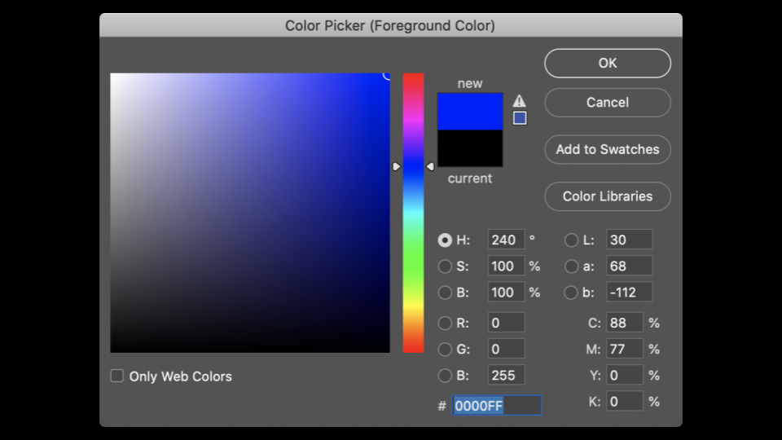
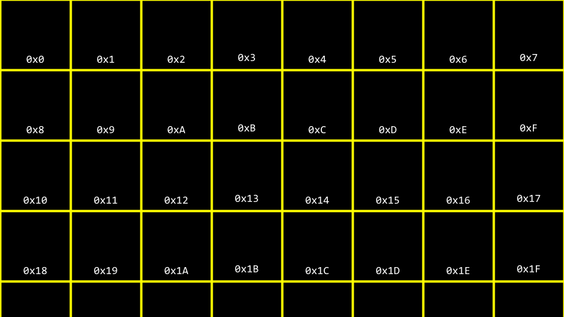
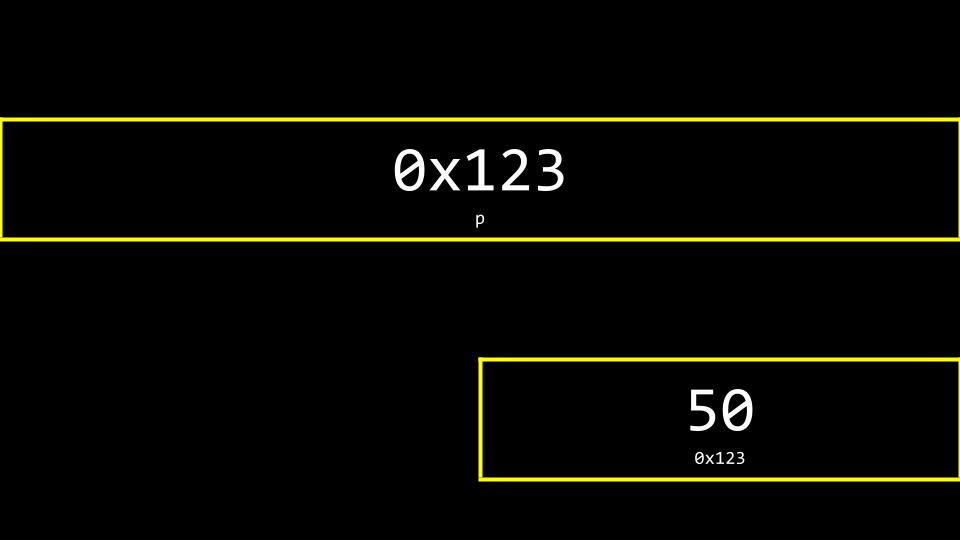
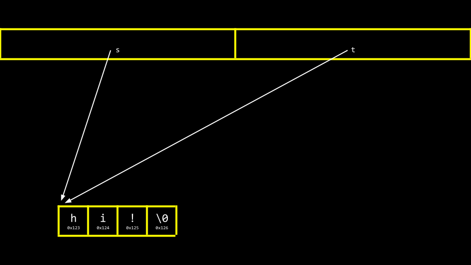
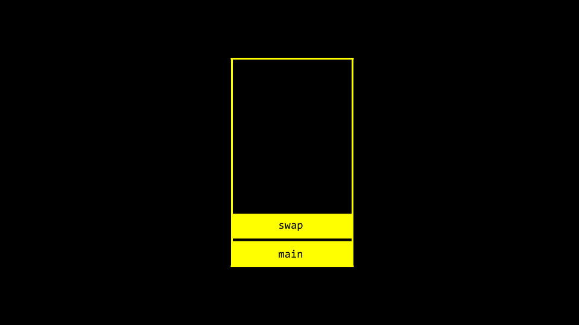
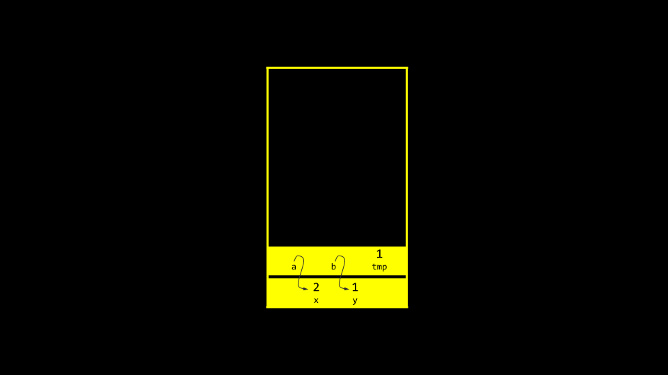
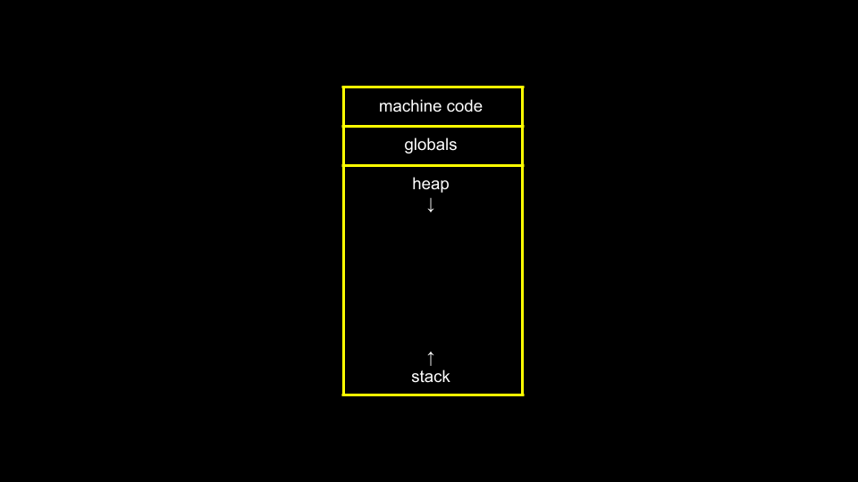

# Lecture 4 - Memory

## Pixelart



A picture is represented by many pixels with a colour value of Red Green and Blue. Each colour has a value between **1** and **255**

## Hexadecimal

hexadecimal is counting with base 16, **0-F**(*0-15*)

```c
0 1 2 3 4 5 6 7 8 9 a b c d e f

9 [base 10] == 09 [base 16]
15 [base 10] == 0F [base 19]
255 [base 10] == FF [base 16]
```

It is convention to prefix hexadecimal numbers with "**0x**"

```c
123 == 0x7B
```

## Memory

We have earlier visualized memory as a grid:



### addresses.c

```c
#include <stdio.h>

int main(void)
{
    int n = 50;
    printf("%p\n", &n);
}
```

```c
& Provides the address of something stored in memory.
* Instructs the compiler to go to a location in memory.
```

This program prints out the address of "**n**" using ```%p``` and ```&n```

## Pointers

Pointer is a variable that contains the address of some value.

```c
int n = 50;

int *p = &n;
```

"hey compiler, give me a variable called **'p'**, iside of which i can store the address of the integer **'n'**."

```c
#include <stdio.h>

int main(void)
{
    int n = 50;
    int *p = &n;
    printf("%p\n", p);
}
```

this code does the same ase the one above, printing the address,just using more syntax.

```c
#include <stdio.h>

int main(void)
{
    int n = 50;
    int *p = &n;
    printf("%i\n", *p);
}
```

This will print "**50**"

```int *p``` is the syntax for declaring a pointer.

```*p``` without using the type means "go there."

### Visualized



- a pointer is stored as an 8-byte value

- an integer is stored as a 4-byte value


The address (place in memory) is rather abstract, it the "pointing" is the important part, not that you know the exakt hexadecimal place in the memory.

## Strings

In CS50 earlier a string datatype has been called ```string``` for example ```string s = "HI!"```

"**s**" in this case is a pointer to another place in memory where the array of characters is stored.

```c
#include <stdio.h>

int main(void)
{
    char *s = "HI!";
    printf("%s\n", s);
}
```

Will print ```HI!```

This is how you would represent a string without the training wheels of the cs50 library.

```typedef char *string``` is the code written in the library

## Pointer Arithmetic

```c
#include <stdio.h>

int main(void)
{
    char *s = "HI!";
    printf("%c", s[0]);
    printf("%c", s[1]);
    printf("%c\n", s[2]);
}
```

Will print ```HI!```

-----

```c
#include <stdio.h>

int main(void)
{
    char *s = "HI!";
    printf("%c", *s);
    printf("%c", *(s + 1));
    printf("%c\n", *(s + 2));
}
```

Will print ```HI!``` the same thing.

## String Comparison

When comparing integers it is quite simple using the ```==```:

```c
#include <cs50.h>
#include <stdio.h>

int main(void)
{
    // Get two integers
    int i = get_int("i: ");
    int j = get_int("j: ");

    // Compare integers
    if (i == j)
    {
        printf("Same\n");
    }
    else
    {
        printf("Different\n");
    }
}
```

But for strings it is not as easy

```c
#include <cs50.h>
#include <stdio.h>

int main(void)
{
    // Get two strings
    char *s = get_string("s: ");
    char *t = get_string("t: ");

    // Compare strings' addresses
    if (s == t)
    {
        printf("Same\n");
    }
    else
    {
        printf("Different\n");
    }
}
```

This code doesn't work because it compares the memory addresses for the strings. Therefore it will always output different.

```c
#include <cs50.h>
#include <stdio.h>
#include <string.h>

int main(void)
{
    // Get two strings
    char *s = get_string("s: ");
    char *t = get_string("t: ");

    // Compare strings
    if (strcmp(s, t) == 0)
    {
        printf("Same\n");
    }
    else
    {
        printf("Different\n");
    }
}
```

Using strcmp(char*, char*) we can compare strings. strcmp() return 0 if they are the same.

```c
#include <cs50.h>
#include <stdio.h>

int main(void)
{
    // Get two strings
    char *s = get_string("s: ");
    char *t = get_string("t: ");

    // Print strings' addresses
    printf("%p\n", s);
    printf("%p\n", t);
}
```

This visualizes that the strings doesn't have the same address even if they have the same words.

## Copying

```c
#include <cs50.h>
#include <ctype.h>
#include <stdio.h>
#include <string.h>

int main(void)
{
    // Get a string
    string s = get_string("s: ");

    // Copy string's address
    string t = s;

    // Capitalize first letter in string
    if (strlen(t) > 0)
    {
        t[0] = toupper(t[0]);
    }

    // Print string twice
    printf("s: %s\n", s);
    printf("t: %s\n", t);
}
```

This will only copy the memory addresses and thus both "**s**" and "**t**" will have the first letter capitalized.



These two pointer are pointing at the same thing.

-----

```malloc()``` the only argument is the amount of bytes you want the OS to free up a specific purpose. That is also the function of this funcion, MemoryALLOCation.

```free()``` Allows you to free up that block of memory.

These are from the ```<stdlib.h>``` library.

```c
#include <cs50.h>
#include <ctype.h>
#include <stdio.h>
#include <stdlib.h>
#include <string.h>

int main(void)
{
    // Get a string
    char *s = get_string("s: ");

    // Allocate memory for another string
    char *t = malloc(strlen(s) + 1);

    // Copy string into memory, including '\0'
    for (int i = 0, n = strlen(s); i <= n; i++)
    {
        t[i] = s[i];
    }

    // Capitalize copy
    t[0] = toupper(t[0]);

    // Print strings
    printf("s: %s\n", s);
    printf("t: %s\n", t);
}
```

This code will work copying the string and only uppercase the "**t**" string.

Notice how the ```malloc(strlen(s) + 1)``` free up space for the "**\0 (null)**" character aswell with the added "**+ 1**".

Also notice that we declare ```n = strlen(s)``` to not have to call that funtion over and over again and that ```i <= n``` goes through n to also include the "**\0**" character at the end of the string.

```c
#include <cs50.h>
#include <ctype.h>
#include <stdio.h>
#include <stdlib.h>
#include <string.h>

int main(void)
{
    // Get a string
    char *s = get_string("s: ");
    if (s == NULL)
    {
        return 1;
    }

    // Allocate memory for another string
    char *t = malloc(strlen(s) + 1);
    if (t == NULL)
    {
        return 1;
    }

    // Copy string into memory, including '\0'
    for (int i = 0, n = strlen(s); i <= n; i++)
    {
        t[i] = s[i];
    }

    // Capitalize copy
    t[0] = toupper(t[0]);

    // Print strings
    printf("s: %s\n", s);
    printf("t: %s\n", t);

    free(t);
    return 0;
}
```

These extra if statements harden the code by exiting the program early if anything with the memory allocation goes wrong. This also applies to ```get_string()``` if the string is so large it overflows.

The ```free(t)``` at the bottom free up the memory allocated by ```malloc()```. If you doesn't do this the PC might get slow and crash if the memory run out of free space.

You should only free memory that you *"malloced"*

```c
#include <cs50.h>
#include <ctype.h>
#include <stdio.h>
#include <stdlib.h>
#include <string.h>

int main(void)
{
    // Get a string
    char *s = get_string("s: ");
    if (s == NULL)
    {
        return 1;
    }

    // Allocate memory for another string
    char *t = malloc(strlen(s) + 1);
    if (t == NULL)
    {
        return 1;
    }

    // Copy string into memory, including '\0'
    strcpy(t, s);

    // Capitalize copy
    t[0] = toupper(t[0]);

    // Print strings
    printf("s: %s\n", s);
    printf("t: %s\n", t);

    free(t);
    return 0;
}
```

The *for* loop is a reinventing of the wheel. There is a function for that called ```strcpy(destination, source)```

## Valgrind

Valgrind is a tool that can be used to check for memoryrelated issues. It checks that you have used ```free()```.

```c
#include <stdio.h>

int main(void)
{
    int x[3];
    x[0] = 72;
    x[1] = 73;
    x[2] = 33;
}
```

This is the simple way to create an array of 3 integers.

```c
#include <stdio.h>
#include <stdlib.h>

int main(void)
{
    int *x = malloc(3 * sizeof(int));
    x[0] = 72;
    x[1] = 73;
    x[2] = 33;
    free(x);
}
```

If you want control over this process this is how you do it.

```int *x``` give me the pointer (address of an integer) in the place that ```malloc(3 * sizeof(int))``` allocated.

```sizeof()``` will give you the memory size of for example an int.

```Malloc()``` creates a continous space in memory in the specified size. Or more simply called an *array*. This is what we do with *strings*, treating chunks of memory as *arrays* of *chars*.

Using **Valgrind** ```Valgrind ./programname``` will give you an error text if you have memoryfaults in you program.

## Garbage Values

If you declare a variable using a block of memory but don't assign anything to it there is no guarantee that it will be empty.

```c
#include <stdio.h>

int main(void)
{
    int scores[1024];
    for (int i = 0; i < 1024; i++)
    {
        printf("%i\n", scores[i]);
    }
}
```

This program allocates 1024 locations in memory but doesn't assign anything to them. When they are printed you can see all the garbage values stored there if you don't put anything there yourself.

## Swap function

```c
#include <stdio.h>

void swap(int a, int b);

int main(void)
{
    int x = 1;
    int y = 2;

    printf("x is %i, y is %i\n", x, y);
    swap(x, y);
    printf("x is %i, y is %i\n", x, y);
}

void swap(int a, int b)
{
    int tmp = a;
    a = b;
    b = tmp;
}
```

This code, supposed to swap two variables does not work. It is a scope issue and the values **x** and **y** only exist in the *main()* function and are not affected by the *swap()* function. The values in the *swap()* are only copies provided to the function.



The variables of the 2 functions *main()* and *swap()* have to different frames of memory and therefor you can not easily pass values back and forth.

```c
#include <stdio.h>

void swap(int *a, int *b);

int main(void)
{
    int x = 1;
    int y = 2;

    printf("x is %i, y is %i\n", x, y);
    swap(&x, &y);
    printf("x is %i, y is %i\n", x, y);
}

void swap(int *a, int *b)
{
    int tmp = *a;
    *a = *b;
    *b = tmp;
}
```

In this version of the program we **pass the variables by reference** instead of **value** like in the earlier version. The addresses of **a** and **b** are provided to the function. Therefore, the *swap()* function can know where to make changes to the actual **a** and **b** from the *main()* function.



## Overflow



Global variables, live in one place in memory. Various functions are stored in the stack in another area of memory. Malloc are stored in the heap area of memory

- A heap overflow is when you overflow the heap, touching areas of memory you are not supposed to.
- A stack overflow is when too many functions are called, overflowing the amount of memory available.
- Both of these are considered buffer overflows.

## Scanf

```c
#include <stdio.h>

int main(void)
{
    int x;
    printf("n: ");
    scanf("%i", &n);
    printf("n: %i\n", n);
}
```

For *int*s *scanf()* works. But for strings it is hard to know how how to preallocate the right amount of memory.

```c
#include <stdio.h>

int main(void)
{
    char s[4];
    printf("s: ");
    scanf("%s", s);
    printf("s: %s\n", s);
}
```

This code assumes that the user only inputs 3 characters and no more. If more than 4 charcters you will get a segmentation fault.

## File I/O

Commands to read and alter files.

- fopen
- fclose
- fprintf
- fscanf
- fread
- fwrite
- fseek
- ...

```c
#include <cs50.h>
#include <stdio.h>
#include <string.h>

int main(void)
{
    FILE *file = fopen("phonebook.csv", "a");
    if (file == NULL)
    {
        return 1;
    }

    char *name = get_string("Name: ");
    char *number = get_string("Number: ");

    fprintf(file, "%s,%s\n", name, number);

    fclose(file);
}
```

In this program you can append data to a csv file, the comma is harcoded to be added in the *fprintf()* function.

```c
#include <stdio.h>
#include <stdint.h>

typedef uint8_t BYTE;

int main(int argc, char *argv[])
{
    FILE *src = fopen(argv[1], "rb");
    FILE *dst = fopen(argv[2], "wb");

    BYTE b;

    while (fread(&b, sizeof(b), 1, src) !=0)
    {
        fwrite(&b, sizeof(b), 1, dst);
    }

    fclose(dst);
    fclose(src);
}
```
