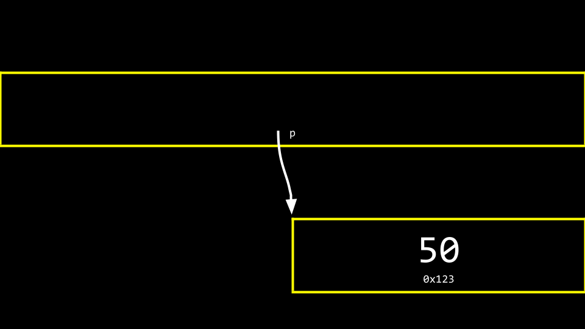

# Lecture 4 - Memory

## Pixelart


A picture is represented by many pixels with a colour value of Red Green and Blue. Each colour has a value between **1** and **255**

## Hexadecimal

hexadecimal is counting with base 16, **0-F**(*0-15*)

```c
0 1 2 3 4 5 6 7 8 9 a b c d e f

9 [base 10] == 09 [base 16]
15 [base 10] == 0F [base 19]
255 [base 10] == FF [base 16]
```

It is convention to prefix hexadecimal numbers with "**0x**"

```c
123 == 0x7B
```

## Memory

We have earlier visualized memory as a grid:


### addresses.c

```c
#include <stdio.h>

int main(void)
{
    int n = 50;
    printf("%p\n", &n);
}
```

```c
& Provides the address of something stored in memory.
* Instructs the compiler to go to a location in memory.
```

This program prints out the address of "**n**" using ```%p``` and ```&n```

## Pointers

Pointer is a variable that contains the address of some value.

```c
int n = 50;

int *p = &n;
```

"hey compiler, give me a variable called **'p'**, iside of which i can store the address of the integer **'n'**."

```c
#include <stdio.h>

int main(void)
{
    int n = 50;
    int *p = &n;
    printf("%p\n", p);
}
```

this code does the same ase the one above, printing the address,just using more syntax.

```c
#include <stdio.h>

int main(void)
{
    int n = 50;
    int *p = &n;
    printf("%i\n", *p);
}
```

This will print "**50**"

```int *p``` is the syntax for declaring a pointer.

```*p``` without using the type means "go there."

### Visualized


- a pointer is stored as an 8-byte value

- an integer is stored as a 4-byte value



The address (place in memory) is rather abstract, it the "pointing" is the important part, not that you know the exakt hexadecimal place in the memory.

## Strings

In CS50 earlier a string datatype has been called ```string``` for example ```string s = "HI!"```

"**s**" in this case is a pointer to another place in memory where the array of characters is stored.

```c
#include <stdio.h>

int main(void)
{
    char *s = "HI!";
    printf("%s\n", s);
}
```

Will print ```HI!```

This is how you would represent a string without the training wheels of the cs50 library.

```typedef char *string``` is the code written in the library

## Pointer Arithmetic

```c
#include <stdio.h>

int main(void)
{
    char *s = "HI!";
    printf("%c", s[0]);
    printf("%c", s[1]);
    printf("%c\n", s[2]);
}
```

Will print ```HI!```

-----

```c
#include <stdio.h>

int main(void)
{
    char *s = "HI!";
    printf("%c", *s);
    printf("%c", *(s + 1));
    printf("%c\n", *(s + 2));
}
```

Will print ```HI!``` the same thing.

## String Comparison

