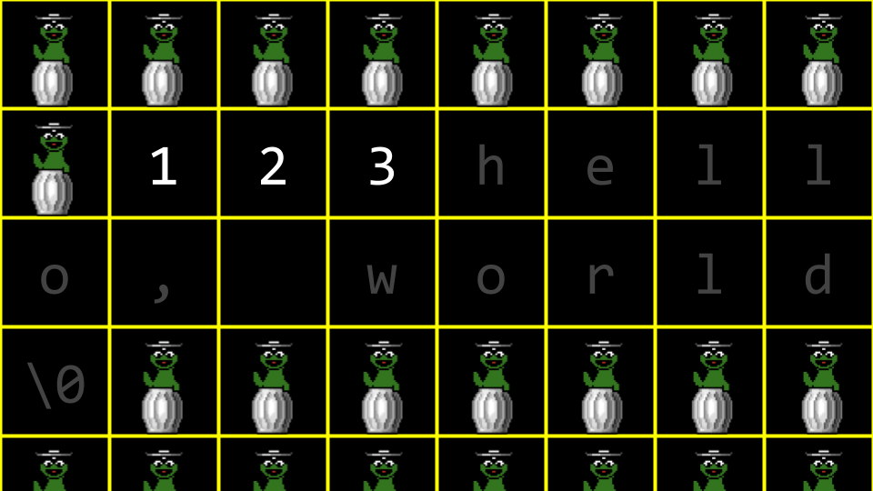
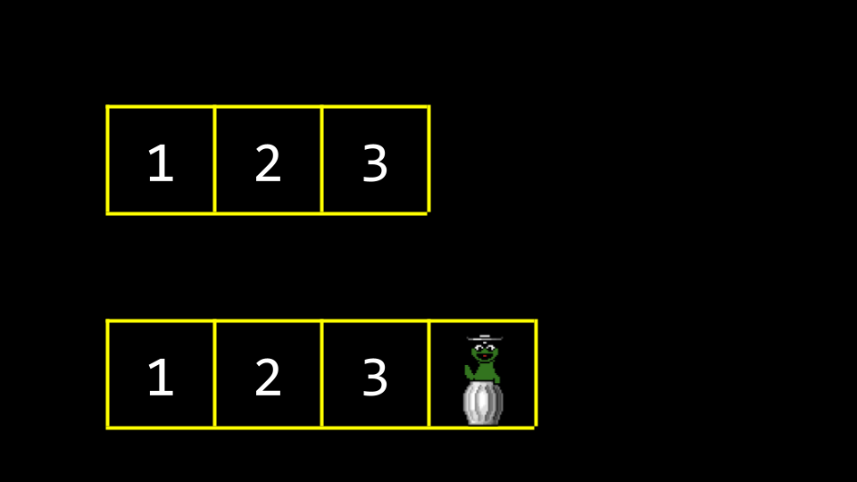
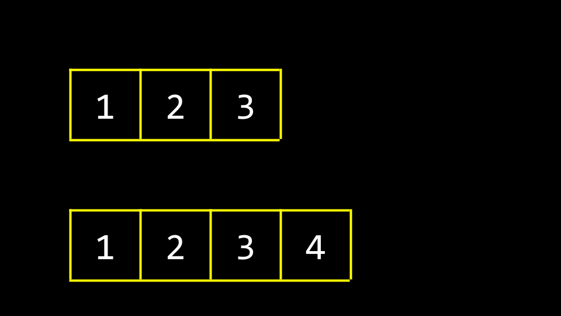
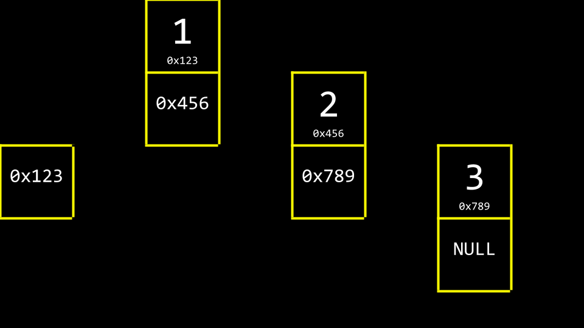
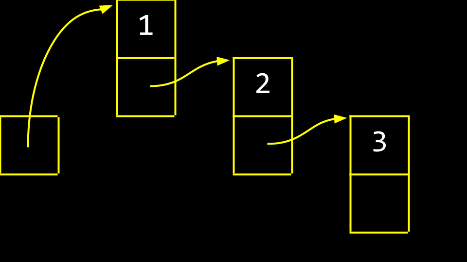
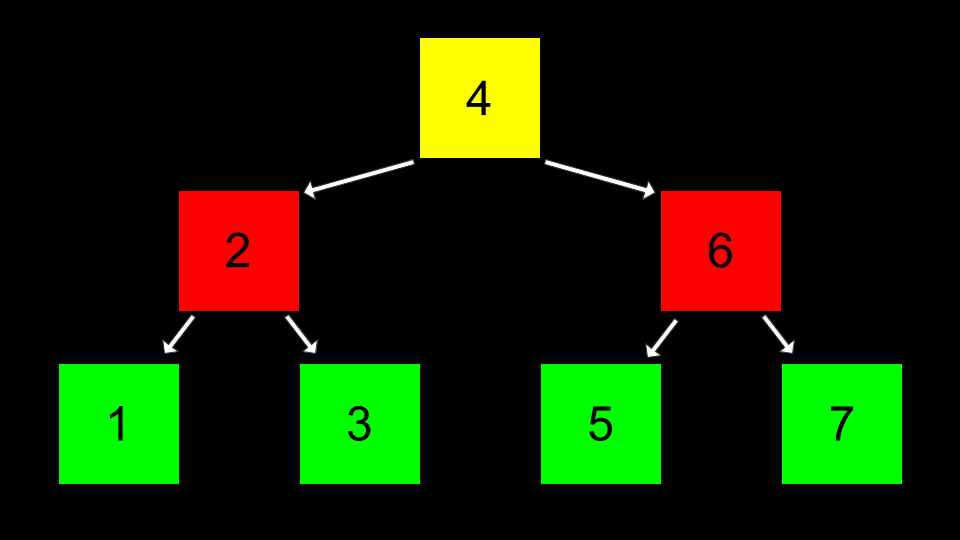
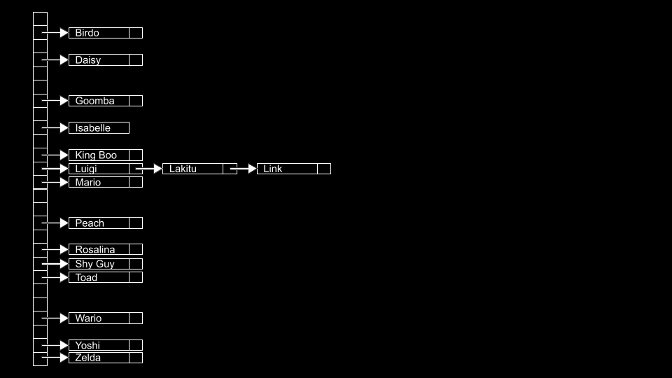
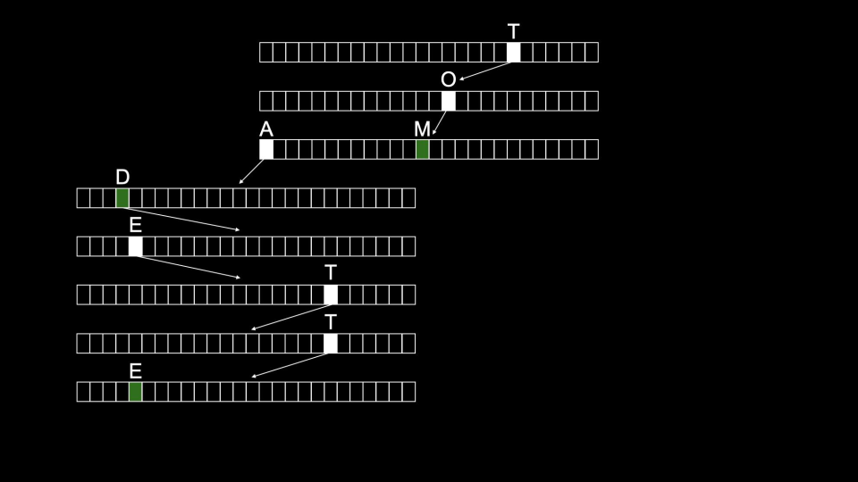

# Lecture 5 - Data Structures

## Data Structures

Are different ways to organize data in memory.

## Stacks and Queues

### Queues

Queues are exaclty like in real life, they are **FIFO**, *First in first out*.

The act of *"Getting in the queue"* is called getting **enqueued**.

The opposite, getting to go on the ride or leaving the queue is called getting **dequeued**.

```c
const int CAPACITY

typedef struct
{
    person people[CAPACITY];
    int size;
} queue;
```

### Stacks

Stacks are like stacking clothes in a drawer, they are **LIFO**, *Last in first out*.

The act of putting something on the top of the stack is called **push**.

The act of taking something from the top of the stack is called **pop**.

```c
typedef struct
{
    person people[CAPACITY];
    int size;
} stack;
```

Observe that this code is in no way different from the queue. this struct does not include the LIFO or FIFO code needed to differentiate the two.

## Resizing Array

An array is a block of continious memory and is a type of data structure.



```c
#include <stdio.h>

int main(void)
{
    int list[3];

    list[0] = 1;
    list[1] = 2;
    list[2] = 3;

    for (int i = 0; i < 3; i++)
    {
        printf("%i\n", list[i]);
    }
}
```

Imagine this array of 3. Now you want to store a fourth value. This is not possible due to the string in the way, and storing the next value somewhere else would not make it an array.





You could copy it to another place that is one space bigger and then add the new value.

This is bad design because we have to copy the array number by number and the array takes up double the space during the copying.

```c
#include <stdio.h>
#include <stdlib.h>

int main(void)
{
    // List of size 3
    int *list = malloc(3 * sizeof(int));
    if (list == NULL)
    {
        return 1;
    }

    // Initialize list of size 3 with numbers
    list[0] = 1;
    list[1] = 2;
    list[2] = 3;

    // List of size 4
    int *tmp = malloc(4 * sizeof(int));
    if (tmp == NULL)
    {
        free(list);
        return 1;
    }

    // Copy list of size 3 into list of size 4
    for (int i = 0; i < 3; i++)
    {
        tmp[i] = list[i];
    }

    // Add number to list of size 4
    tmp[3] = 4;

    // Free list of size 3
    free(list);

    // Remember list of size 4
    list = tmp;

    // Print list
    for (int i = 0; i < 4; i++)
    {
        printf("%i\n", list[i]);
    }

    // Free list
    free(list);
    return 0;
}
```

It’s useful to think about *list* and *tmp* as both signs that point at a chunk of memory. As in the example above, *list* at one point pointed to an array of size 3. By the end, *list* was told to point to a chunk of memory of size 4. Technically, by the end of the above code, *tmp* and *list* both pointed to the same block of memory.

## Linked Lists

### Operators

A *struct* is a data type that you can define yourself.

A *.* in dot notation allows you to access variables inside that structure.

The *\** operator is used to declare a pointer or dereference a variable.

The *->* operator goes to an address and looks inside of a structure.

A linked list is one of the most powerful data structures within C. A linked list allows you to include values that are located at varying areas of memory. Further, they allow you to dynamically grow and shrink the list as you desire.

### Abstract linked list

You might imagine three values stored at three different areas of memory as follows:



A choice between space efficiency and speed has been made. Each datapoint in the linked list takes up two spaces in memory. The first space is the data. The other space, or metadata, is a pointer pointing to the next datapoint in the list.



These boxes are called nodes. A node contains both an *item* and a pointer called *next*.

```c
typedef struct node
{
    int number;
    struct node *next;
}
node;
```

### Linked Lists in code

```c
// Prepends numbers to a linked list, using while loop to print

#include <cs50.h>
#include <stdio.h>
#include <stdlib.h>

typedef struct node
{
    int number;
    struct node *next;
}
node;

int main(int argc, char *argv[])
{
    // Memory for numbers
    node *list = NULL;

    // For each command-line argument
    for (int i = 1; i < argc; i++)
    {
        // Convert argument to int
        int number = atoi(argv[i]);

        // Allocate node for number
        node *n = malloc(sizeof(node));
        if (n == NULL)
        {
            return 1;
        }
        n->number = number;
        n->next = NULL;

        // Prepend node to list
        n->next = list;
        list = n;
    }

    // Print numbers
    node *ptr = list;
    while (ptr != NULL)
    {
        printf("%i\n", ptr->number);
        ptr = ptr->next;
    }

    // Free memory
    ptr = list;
    while (ptr != NULL)
    {
        node *next = ptr->next;
        free(ptr);
        ptr = next;
    }
}
```

Notice that what the user inputs at the command line is put into the number field of a node called n, and then that node is added to the list. For example, ./list 1 2 will put the number 1 into the number field of a node called n, then put a pointer to list into the next field of the node, and then update list to point to n. That same process is repeated for 2. Next, node *ptr = list creates a temporary variable that points at the same spot that list points to. The while prints what at the node ptr points to, and then updates ptr to point to the next node in the list. Finally, all the memory is freed.

This approach prepends each number when adding meaning they will be in reverse order when printed.

```c
// Implements a list of numbers using a linked list

#include <cs50.h>
#include <stdio.h>
#include <stdlib.h>

typedef struct node
{
    int number;
    struct node *next;
}
node;

int main(int argc, char *argv[])
{
    // Memory for numbers
    node *list = NULL;

    // For each command-line argument
    for (int i = 1; i < argc; i++)
    {
        // Convert argument to int
        int number = atoi(argv[i]);

        // Allocate node for number
        node *n = malloc(sizeof(node));
        if (n == NULL)
        {
            return 1;
        }
        n->number = number;
        n->next = NULL;

        // If list is empty
        if (list == NULL)
        {
            // This node is the whole list
            list = n;
        }

        // If list has numbers already
        else
        {
            // Iterate over nodes in list
            for (node *ptr = list; ptr != NULL; ptr = ptr->next)
            {
                // If at end of list
                if (ptr->next == NULL)
                {
                    // Append node
                    ptr->next = n;
                    break;
                }
            }
        }
    }

    // Print numbers
    for (node *ptr = list; ptr != NULL; ptr = ptr->next)
    {
        printf("%i\n", ptr->number);
    }

    // Free memory
    node *ptr = list;
    while (ptr != NULL)
    {
        node *next = ptr->next;
        free(ptr);
        ptr = next;
    }
}
```

This approach appends the new items by checking the whole list until pointer variable is NULL, then appending.

```c
// Implements a sorted list of numbers using a linked list

#include <cs50.h>
#include <stdio.h>
#include <stdlib.h>

typedef struct node
{
    int number;
    struct node *next;
}
node;

int main(int argc, char *argv[])
{
    // Memory for numbers
    node *list = NULL;

    // For each command-line argument
    for (int i = 1; i < argc; i++)
    {
        // Convert argument to int
        int number = atoi(argv[i]);

        // Allocate node for number
        node *n = malloc(sizeof(node));
        if (n == NULL)
        {
            return 1;
        }
        n->number = number;
        n->next = NULL;

        // If list is empty
        if (list == NULL)
        {
            list = n;
        }

        // If number belongs at beginning of list
        else if (n->number < list->number)
        {
            n->next = list;
            list = n; 
        }

        // If number belongs later in list
        else
        {
            // Iterate over nodes in list
            for (node *ptr = list; ptr != NULL; ptr = ptr->next)
            {
                // If at end of list
                if (ptr->next == NULL)
                {
                    // Append node
                    ptr->next = n;
                    break;
                }

                // If in middle of list
                if (n->number < ptr->next->number)
                {
                    n->next = ptr->next;
                    ptr->next = n;
                    break;
                }
            }
        }
    }

    // Print numbers
    for (node *ptr = list; ptr != NULL; ptr = ptr->next)
    {
        printf("%i\n", ptr->number);
    }

    // Free memory
    node *ptr = list;
    while (ptr != NULL)
    {
        node *next = ptr->next;
        free(ptr);
        ptr = next;
    }
}
```

This list is sorted as it is built.

## Trees



A sequence of numbers that have been spaced out in 2 dimensions to allow for binary search to work.

root number has pointer pointing to its leaves.

```c
// Implements a list of numbers as a binary search tree

#include <stdio.h>
#include <stdlib.h>

// Represents a node
typedef struct node
{
    int number;
    struct node *left;
    struct node *right;
}
node;

void free_tree(node *root);
void print_tree(node *root);

int main(void)
{
    // Tree of size 0
    node *tree = NULL;

    // Add number to list
    node *n = malloc(sizeof(node));
    if (n == NULL)
    {
        return 1;
    }
    n->number = 2;
    n->left = NULL;
    n->right = NULL;
    tree = n;

    // Add number to list
    n = malloc(sizeof(node));
    if (n == NULL)
    {
        free_tree(tree);
        return 1;
    }
    n->number = 1;
    n->left = NULL;
    n->right = NULL;
    tree->left = n;

    // Add number to list
    n = malloc(sizeof(node));
    if (n == NULL)
    {
        free_tree(tree);
        return 1;
    }
    n->number = 3;
    n->left = NULL;
    n->right = NULL;
    tree->right = n;

    // Print tree
    print_tree(tree);

    // Free tree
    free_tree(tree);
    return 0;
}

void free_tree(node *root)
{
    if (root == NULL)
    {
        return;
    }
    free_tree(root->left);
    free_tree(root->right);
    free(root);
}

void print_tree(node *root)
{
    if (root == NULL)
    {
        return;
    }
    print_tree(root->left);
    printf("%i\n", root->number);
    print_tree(root->right);
}
```

This program hardcodes the numbers 2, 1 and 3 to be added to the tree.

## Dictionaries

Dictionaries, like actual dictionaries that have a word and a definition, have a *key* and a *value*.

Dictionaries can offer a speed of O(1) through hashing.

## Hashing

Hashing is the idea of taking a value and being able to output a value that becomes a shortcut to it later.

Hashing, taking some number of inputs and mapping to a finite number of outputs.

A hash function is an algorithm that reduces a larger value to something small and predictable. Generally, this function takes in an item you wish to add to your hash table, and returns an integer representing the array index in which the item should be placed.



```c
#include <ctype.h>

unsigned int hash(const char *word)
{
    return toupper(word[0]) - 'A';
}
```

## Tries


