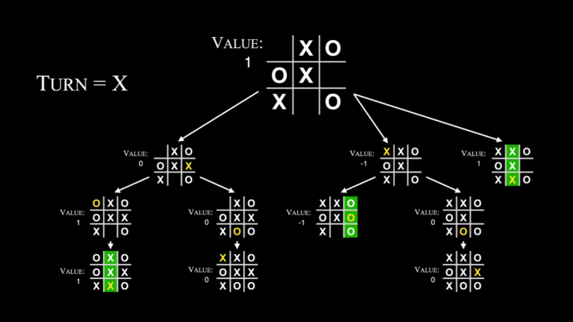
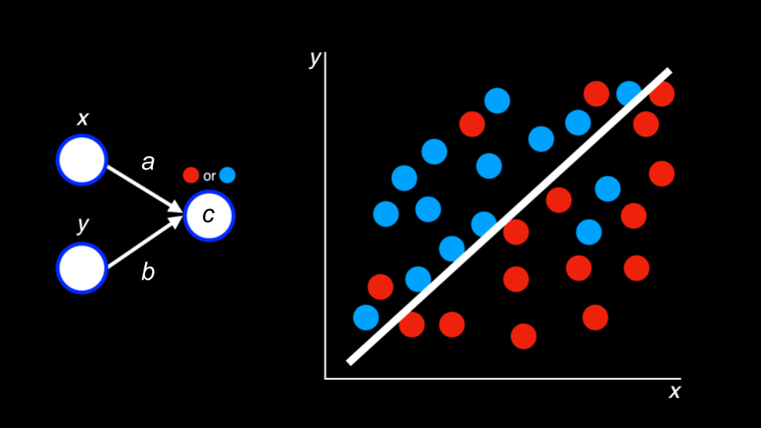
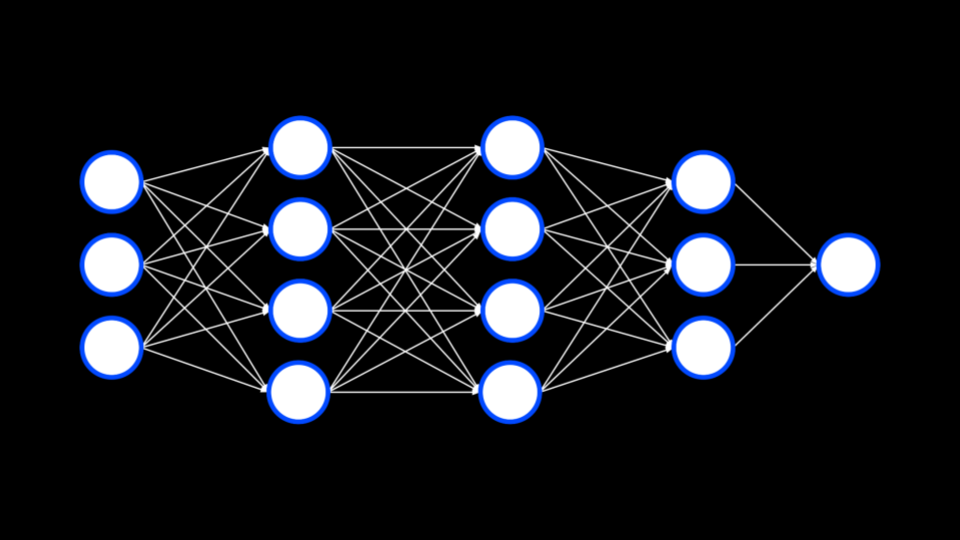

# Lecture 6.5 - Artificial Intelligence

> "Family friendly introduction to AI"

## Image Generation

AI tools have created the possibility of creating artificiall images.

These tools are becoming better and better and it will become harder and harder to discern the differences between a artificially gererated picture and an image captured by a camera.

Where there where tells earlier, like with fingers and small details, are now realistic looking features.

## Prompt Generation

Prompt generation is the way by which an individual can communicate with an AI platform.

CS50 use a system prompt to teach the AI how to interact with users.

## CS50.ai

CS50 use the rubber duck debugger, which is an AI based on OpenAIs ChatGPT.

## Generative AI

AI has been used for a long time.

* Gmails spam detection
* Handwriting to text algorithms
* Recommendation algorithms

In games, for example, step-by-step instructions may allow a computerized adversary play a game of Breakout.

## Decision Trees

Decision trees are used by an algorithm to decide what decision to make.

Breakout-algorithm:

```psuedocode
While game is ongoing:
    If ball is left of paddle:
        Move paddle left
    Else if ball is right of paddle:
        Move paddle right
    Else:
        Don't move paddle
```

Not finished tictactoe algorithm

```psuedocode
If able to get 3 in a row this turn
    Play in square to get 3 in a row
Else if opponent is able to get 3 in a row this turn
    Play in square to block oppenent's 3 in a row
    .
    .
    .
```

### Why AI is good at games

AI really suits itself to:

Inputs and Outputs that can be represented mathematically

Most games have:

A goal in the form of a function to maximize/minimize

## Minimax

In tic-tac-toe, the AI might consider a board where the computer wins as 1 and one where the computer loses as -1.

The computer will attempt to win by maximizing its own score.



```psuedo
If player is X:
For each possible move:
  Calculate score for board
Choose move with highest score

Else if player is O:
  For each possible move:
    Calculate score for board
  Choose move with lowest score
```

Because computers are so powerful, they can crunch massive potential outcomes.

## Machine Learning

Machine learning is a way by which a computer can learn through reinforcement.

Learning by reward and punishment if the program is getting closer or further away from the solution.

Within much of AI-based algorithms, there are concepts of explore vs. exploit, where the AI may randomly try something that may not be considered optimal. Randomness can yield better outcomes.

## Deep Learning

Deep learning uses neural networks whereby problems and solutions are explored.

These are loosely based on how a human brain works with the "weight" or importance of different edges between nodes being the determining factor in changing behavior.



For example, deep learning may attempt to predict whether a blue or red dot will appear somewhere on a graph. Consider the following image:

Existing training data is used to predict an outcome. Further, more training data may be created by the AI to discover further patterns.



With tweaking of different parameters of the edges a different function can arrive.

## Generative Artificial Intelligence

Large language models are massive models that make predictions based on huge amounts of training.

The AI encodes words into embeddings to find relationships between words. Thus, through a huge amount of training, a massive neural network can predict the association between words - resulting in the ability for generative AI to generate content and even have conversations with users.
